# 📊 Diagramas de Base de Datos — Sistema ABIS

## Policía de Investigaciones de Chile — Jefatura Nacional de Migraciones

> Documento técnico con diagramas explicados de la base de datos relacional PostgreSQL del **Sistema de Gestión Automatizada de Identificación Biométrica (ABIS)**.

---

## Índice

1. [Resumen Ejecutivo](#1-resumen-ejecutivo)
2. [Diagrama Entidad-Relación (ERD)](#2-diagrama-entidad-relación-erd)
3. [Diccionario de Tablas](#3-diccionario-de-tablas)
4. [Detalle de Columnas por Tabla](#4-detalle-de-columnas-por-tabla)
5. [Diagrama de Jerarquía Territorial PDI](#5-diagrama-de-jerarquía-territorial-pdi)
6. [Catálogo de Estados de Proceso](#6-catálogo-de-estados-de-proceso)
7. [Modelo Dimensional (Estrella Analítica)](#7-modelo-dimensional-estrella-analítica)
8. [Diagrama de Vistas SQL](#8-diagrama-de-vistas-sql)
   - [8.1. Evidencia Operativa: Dashboard Web](#81-evidencia-operativa-dashboard-web-alimentado-por-vistas-sql)
9. [Diagrama de Flujo de Datos (ETL → BD → Salidas)](#9-diagrama-de-flujo-de-datos-etl--bd--salidas)
10. [Índices y Optimización](#10-índices-y-optimización)
11. [Seguridad y Auditoría](#11-seguridad-y-auditoría)
12. [Normalización (3FN)](#12-normalización-3fn)

---

## 1. Resumen Ejecutivo

| Característica                              | Valor                                                                           |
| :------------------------------------------- | :------------------------------------------------------------------------------ |
| **Motor de Base de Datos**             | PostgreSQL 16                                                                   |
| **Normalización**                     | Tercera Forma Normal (3FN)                                                      |
| **Total de Registros Transaccionales** | **95.474 enrolamientos biométricos**                                     |
| **Rango de Fechas Operativas**         | 01-06-2023 al 22-08-2026 (**1.140 días con datos**)                      |
| **Tablas Base**                        | 8 tablas                                                                        |
| **Vistas Analíticas**                 | 7 vistas de solo lectura                                                        |
| **Índices de Rendimiento**            | 7 índices B-Tree estratégicos                                                 |
| **Extensión Criptográfica**          | `pgcrypto` (AES-256-GCM + SHA-256)                                            |
| **Volúmenes de Catálogos**           | 71 nacionalidades, 6 regiones, 23 unidades, 24 cuarteles, 2 equipos, 10 estados |
| **Registros de Auditoría**            | 192 eventos trazados                                                            |

---

## 2. Diagrama Entidad-Relación (ERD)

Este es el diagrama principal de la base de datos. Muestra **todas las tablas, sus columnas, tipos de datos y las relaciones entre ellas** (llaves primarias PK y llaves foráneas FK).

### ¿Qué significa cada símbolo?

- **`||--o{`** = Relación de **uno a muchos** (1:N). Ejemplo: una región tiene muchas unidades.
- **`PK`** = Llave Primaria (identificador único de cada fila).
- **`FK`** = Llave Foránea (referencia a otra tabla, garantiza integridad referencial).

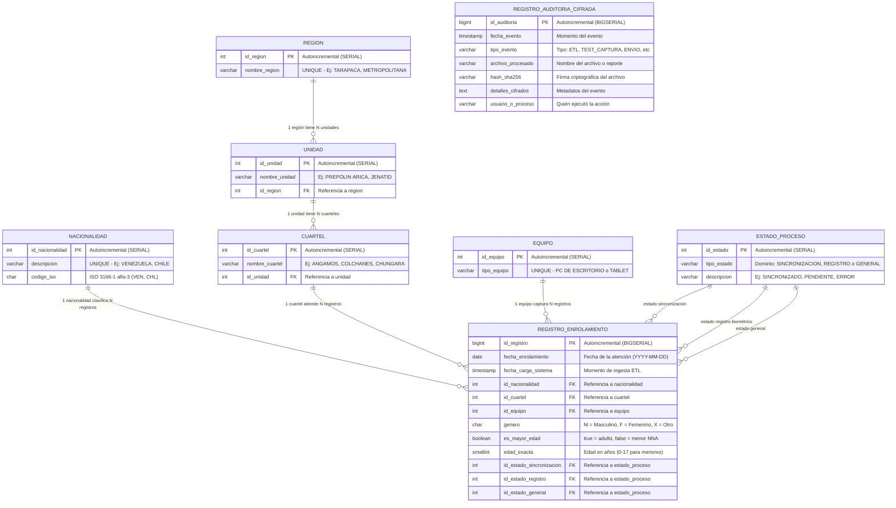

### Explicación del Diagrama ER

La tabla central es **`registro_enrolamiento`** (95.474 filas). Cada fila representa **un enrolamiento biométrico individual** (una persona que fue atendida en un cuartel policial). Esa tabla NO guarda los nombres de cuarteles, nacionalidades o estados directamente como texto — guarda **referencias numéricas** (FK) a tablas separadas que almacenan esos catálogos. Esto se llama **normalización** y tiene tres ventajas:

1. **No se repiten datos**: El nombre "VENEZUELA" se guarda UNA sola vez en la tabla `nacionalidad`, y los 95.474 registros solo guardan el número `id_nacionalidad`.
2. **Consistencia garantizada**: Si se escribe mal "VNEZUELA", la base de datos la RECHAZA porque no existe en el catálogo.
3. **Cambios centralizados**: Si un cuartel cambia de nombre, se actualiza en UN solo lugar.

La tabla `registro_enrolamiento` tiene **3 llaves foráneas al mismo catálogo** `estado_proceso`:

- `id_estado_sincronizacion` → ¿Se sincronizó con la PDI? (SINCRONIZADO / PENDIENTE / ERROR)
- `id_estado_registro` → ¿Se registró biométricamente? (REGISTRADO / PENDIENTE / ERROR)
- `id_estado_general` → ¿Estado documental global? (OK / REGISTRADO / CON_ERROR / ERROR)

La tabla **`registro_auditoria_cifrada`** es independiente: no tiene FK hacia ninguna otra tabla. Es un **libro mayor inmutable** donde se registra cada evento del sistema (cargas ETL, envíos a Telegram, etc.) con su firma hash SHA-256 para garantizar no-repudio.

---

## 3. Diccionario de Tablas

| # | Tabla                                    | Tipo                   |  Filas Actuales  | Propósito                                                                                                                               |
| :-: | :--------------------------------------- | :--------------------- | :--------------: | :--------------------------------------------------------------------------------------------------------------------------------------- |
| 1 | **`registro_enrolamiento`**      | Transaccional (Hechos) | **95.474** | Tabla principal. Almacena cada atención biométrica realizada por la PDI. Cada fila = una persona enrolada.                             |
| 2 | **`nacionalidad`**               | Catálogo (Dimensión) |        71        | Países de origen con código ISO-3 (Venezuela, Chile, Colombia, Bolivia, etc.).                                                         |
| 3 | **`region`**                     | Catálogo (Dimensión) |        6        | Regiones policiales de Chile donde opera ABIS (Arica-Parinacota, Tarapacá, Atacama, Metropolitana, Antofagasta, SERMIG).                |
| 4 | **`unidad`**                     | Catálogo (Dimensión) |        23        | Unidades policiales operativas (Prefecturas, Departamentos y JENATID). Cada unidad pertenece a una región.                              |
| 5 | **`cuartel`**                    | Catálogo (Dimensión) |        24        | Puntos de atención policial y pasos fronterizos (Angamos, Colchanes, Chungará, Chacalluta, etc.). Cada cuartel pertenece a una unidad. |
| 6 | **`equipo`**                     | Catálogo (Dimensión) |        2        | Dispositivos de captura biométrica:`PC DE ESCRITORIO` y `TABLET`.                                                                   |
| 7 | **`estado_proceso`**             | Catálogo Polimórfico |        10        | Estados de procesamiento, agrupados por 3 dominios: Sincronización (3), Registro (3) y General (4).                                     |
| 8 | **`registro_auditoria_cifrada`** | Seguridad              |       192       | Bitácora criptográfica inmutable. Registra cada archivo procesado y cada envío con hash SHA-256.                                      |

---

## 4. Detalle de Columnas por Tabla

### 4.1. `registro_enrolamiento` — Tabla Principal (95.474 filas)

| Columna                      | Tipo PostgreSQL | Obligatoria | Restricción                      | Descripción                              |
| :--------------------------- | :-------------- | :---------: | :-------------------------------- | :---------------------------------------- |
| `id_registro`              | `BIGSERIAL`   |     Sí     | PK, autoincremental               | Identificador único de cada enrolamiento |
| `fecha_enrolamiento`       | `DATE`        |     Sí     | Indexado                          | Fecha de la atención biométrica         |
| `fecha_carga_sistema`      | `TIMESTAMP`   |     Sí     | Default:`NOW()`                 | Momento en que se insertó vía ETL       |
| `id_nacionalidad`          | `INTEGER`     |     Sí     | FK →`nacionalidad`             | País de origen del enrolado              |
| `id_cuartel`               | `INTEGER`     |     Sí     | FK →`cuartel`, Indexado        | Cuartel donde se atendió                 |
| `id_equipo`                | `INTEGER`     |     Sí     | FK →`equipo`                   | Dispositivo utilizado (Tablet/PC)         |
| `genero`                   | `CHAR(1)`     |     Sí     | CHECK:`M`, `F` o `X`        | Género del enrolado                      |
| `es_mayor_edad`            | `BOOLEAN`     |     Sí     | —                                | `true` = adulto, `false` = menor NNA  |
| `edad_exacta`              | `SMALLINT`    |     No     | —                                | Edad en años (útil para N.N.A.: 0-17)   |
| `id_estado_sincronizacion` | `INTEGER`     |     Sí     | FK →`estado_proceso`, Indexado | Estado SLA PDI                            |
| `id_estado_registro`       | `INTEGER`     |     Sí     | FK →`estado_proceso`, Indexado | Estado biométrico ABIS                   |
| `id_estado_general`        | `INTEGER`     |     Sí     | FK →`estado_proceso`, Indexado | Estado documental general                 |

### 4.2. `nacionalidad` (71 filas)

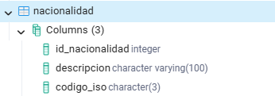

| Columna             | Tipo             | Restricción     | Descripción                             |
| :------------------ | :--------------- | :--------------- | :--------------------------------------- |
| `id_nacionalidad` | `SERIAL`       | PK               | ID autonumérico                         |
| `descripcion`     | `VARCHAR(100)` | UNIQUE, NOT NULL | Nombre del país (Ej: VENEZUELA, CHILE)  |
| `codigo_iso`      | `CHAR(3)`      | Nullable         | Código ISO 3166-1 alfa-3 (Ej: VEN, CHL) |

### 4.3. `region` (6 filas)

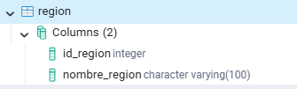

| Columna           | Tipo             | Restricción     | Descripción                  |
| :---------------- | :--------------- | :--------------- | :---------------------------- |
| `id_region`     | `SERIAL`       | PK               | ID autonumérico              |
| `nombre_region` | `VARCHAR(100)` | UNIQUE, NOT NULL | Nombre de la región policial |

**Regiones actuales**: ARICA - PARINACOTA, TARAPACA, ATACAMA, SERMIG, METROPOLITANA, ANTOFAGASTA.

### 4.4. `unidad` (23 filas)

| Columna           | Tipo             | Restricción                      | Descripción                 |
| :---------------- | :--------------- | :-------------------------------- | :--------------------------- |
| `id_unidad`     | `SERIAL`       | PK                                | ID autonumérico             |
| `nombre_unidad` | `VARCHAR(150)` | UNIQUE(nombre, región), NOT NULL | Nombre de la unidad policial |
| `id_region`     | `INTEGER`      | FK →`region`, NOT NULL         | Región a la que pertenece   |

### 4.5. `cuartel` (24 filas)

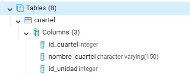

| Columna            | Tipo             | Restricción                     | Descripción                         |
| :----------------- | :--------------- | :------------------------------- | :----------------------------------- |
| `id_cuartel`     | `SERIAL`       | PK                               | ID autonumérico                     |
| `nombre_cuartel` | `VARCHAR(150)` | UNIQUE(nombre, unidad), NOT NULL | Nombre del cuartel o paso fronterizo |
| `id_unidad`      | `INTEGER`      | FK →`unidad`, NOT NULL        | Unidad a la que pertenece            |

### 4.6. `equipo` (2 filas)

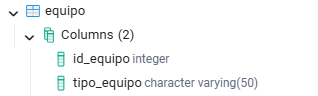

| Columna         | Tipo            | Restricción     | Descripción                      |
| :-------------- | :-------------- | :--------------- | :-------------------------------- |
| `id_equipo`   | `SERIAL`      | PK               | ID autonumérico                  |
| `tipo_equipo` | `VARCHAR(50)` | UNIQUE, NOT NULL | `PC DE ESCRITORIO` o `TABLET` |

### 4.7. `estado_proceso` (10 filas)

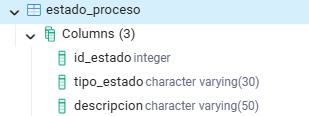

| Columna         | Tipo            | Restricción                 | Descripción                                           |
| :-------------- | :-------------- | :--------------------------- | :----------------------------------------------------- |
| `id_estado`   | `SERIAL`      | PK                           | ID autonumérico                                       |
| `tipo_estado` | `VARCHAR(30)` | UNIQUE(tipo, desc), NOT NULL | Dominio:`SINCRONIZACION`, `REGISTRO` o `GENERAL` |
| `descripcion` | `VARCHAR(50)` | NOT NULL                     | Valor dentro del dominio                               |

### 4.8. `registro_auditoria_cifrada` (192 filas)

| Columna               | Tipo             | Restricción                          | Descripción                                         |
| :-------------------- | :--------------- | :------------------------------------ | :--------------------------------------------------- |
| `id_auditoria`      | `BIGSERIAL`    | PK                                    | ID autonumérico                                     |
| `fecha_evento`      | `TIMESTAMP`    | NOT NULL, Default:`NOW()`, Indexado | Momento del evento                                   |
| `tipo_evento`       | `VARCHAR(50)`  | NOT NULL                              | Tipo:`CARGA_ETL`, `ENVIO_CAPTURA_TELEGRAM`, etc. |
| `archivo_procesado` | `VARCHAR(255)` | NOT NULL                              | Nombre del archivo o reporte procesado               |
| `hash_sha256`       | `VARCHAR(64)`  | NOT NULL                              | Firma criptográfica SHA-256                         |
| `detalles_cifrados` | `TEXT`         | Nullable                              | Metadatos adicionales del evento                     |
| `usuario_o_proceso` | `VARCHAR(100)` | NOT NULL, Default:`SISTEMA_ABIS`    | Responsable de la acción                            |

---

## 5. Diagrama de Jerarquía Territorial PDI

La base de datos modela la estructura organizativa policial en **3 niveles** de jerarquía. Cada cuartel pertenece a exactamente una unidad, y cada unidad a exactamente una región:

```mermaid
graph TD
    R1["🏛️ ARICA - PARINACOTA"]
    R2["🏛️ TARAPACA"]
    R3["🏛️ ATACAMA"]
    R4["🏛️ SERMIG"]
    R5["🏛️ METROPOLITANA"]
    R6["🏛️ ANTOFAGASTA"]

    R1 --> U1["🏢 PREPOLIN ARICA"]
    R1 --> U2["🏢 BRIANCO ARICA"]
    R1 --> U3["🏢 AVANCHACA"]
    R1 --> U4["🏢 BH ARICA"]
    R1 --> U5["🏢 BICRIM ARICA"]
    R1 --> U14["🏢 ... y 9 más"]
  
    R2 --> U6["🏢 POLINT IQUIQUE"]
    R2 --> U7["🏢 BRISEX IQUIQUE"]
  
    R3 --> U8["🏢 POLINT COPIAPO"]
  
    R4 --> U9["🏢 JENATID (SERMIG)"]
  
    R5 --> U10["🏢 JENAMIG"]
    R5 --> U11["🏢 NEC"]
  
    R6 --> U12["🏢 POLINT ANTOFAGASTA"]

    U1 --> C1["📍 ANGAMOS"]
    U1 --> C2["📍 CHACALLUTA"]
    U1 --> C3["📍 CHUNGARA"]
    U1 --> C4["📍 CUYA"]
    U1 --> C5["📍 COLCHANES"]
  
    U2 --> C6["📍 BELEN"]
    U3 --> C7["📍 AVANCHACA"]
  
    U6 --> C8["📍 COLCHANES"]
    U6 --> C9["📍 PEDRO PRADO"]
    U6 --> C10["📍 HUARA"]
    U6 --> C11["📍 IQUIQUE"]
    U6 --> C12["📍 ALTO HOSPICIO"]
    U6 --> C13["📍 ... y 3 más"]
  
    U8 --> C14["📍 COPIAPO"]
    U8 --> C15["📍 CARRERA"]
  
    U9 --> C16["📍 JENATID"]
  
    U10 --> C17["📍 JENAMIG"]
    U10 --> C18["📍 SUBDICOR"]
  
    U12 --> C19["📍 CUARTEL ANTOFAGASTA"]

    classDef region fill:#1a3c5e,stroke:#ffcc00,stroke-width:2px,color:#fff;
    classDef unidad fill:#2c5f8a,stroke:#87ceeb,stroke-width:1px,color:#fff;
    classDef cuartel fill:#3a7cb8,stroke:#b0d4f1,stroke-width:1px,color:#fff;
    class R1,R2,R3,R4,R5,R6 region;
    class U1,U2,U3,U4,U5,U6,U7,U8,U9,U10,U11,U12,U14 unidad;
    class C1,C2,C3,C4,C5,C6,C7,C8,C9,C10,C11,C12,C13,C14,C15,C16,C17,C18,C19 cuartel;
```

### Explicación

- **Región** (nivel superior): Corresponde a las regiones administrativas de Chile donde la PDI tiene operaciones de enrolamiento ABIS.
- **Unidad** (nivel medio): Son las dependencias policiales dentro de cada región (Prefecturas de Policía Internacional, Brigadas, etc.).
- **Cuartel** (nivel inferior): Son los puntos de atención física donde se realiza la captura biométrica (pasos fronterizos como Chacalluta, Colchanes, Chungará, o dependencias urbanas como Angamos).

> **Nota sobre JENATID/SERMIG**: JENATID (Jefatura Nacional de Tecnología e Identificación) aparece bajo la región SERMIG y representa los registros de migración externa. En los reportes institucionales, estos se agrupan bajo la etiqueta **SERMIG** con 60.377 registros.

---

## 6. Catálogo de Estados de Proceso

La tabla `estado_proceso` es un **catálogo polimórfico** que almacena los estados en 3 dominios independientes. Cada registro de enrolamiento tiene **3 FK simultáneas** apuntando a esta misma tabla:

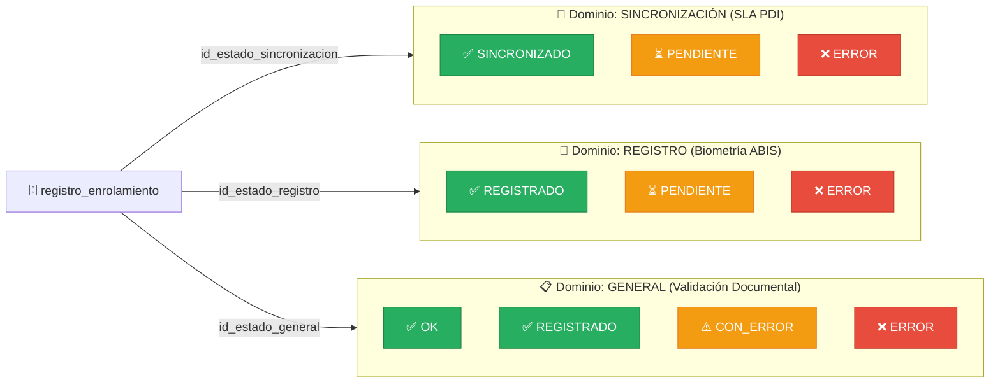

### ¿Por qué 3 estados separados y no 1 solo?

Porque un enrolamiento puede tener **resultados diferentes en cada dominio**. Por ejemplo:

- Una persona puede estar **SINCRONIZADA** con la PDI (estado sincronización = OK) pero tener un **ERROR** en la captura biométrica (estado registro = ERROR).
- Esto permite calcular indicadores independientes como la **Tasa SLA de Sincronización PDI** (que mide qué porcentaje se sincronizó correctamente).

### Tabla de valores actuales

| `tipo_estado` | `descripcion` | Significado Operativo                                    |
| :-------------- | :-------------- | :------------------------------------------------------- |
| SINCRONIZACION  | SINCRONIZADO    | ✅ Dato enviado y confirmado por la PDI Central          |
| SINCRONIZACION  | PENDIENTE       | ⏳ Enviado pero sin confirmación aún                   |
| SINCRONIZACION  | ERROR           | ❌ Fallo en el envío o rechazo de la PDI                |
| REGISTRO        | REGISTRADO      | ✅ Huellas y/o rostro capturados correctamente en ABIS   |
| REGISTRO        | PENDIENTE       | ⏳ Captura incompleta o en cola                          |
| REGISTRO        | ERROR           | ❌ Falla en escáner Suprema o cámara facial            |
| GENERAL         | OK              | ✅ Todo el proceso completado sin observaciones          |
| GENERAL         | REGISTRADO      | ✅ Registrado y validado documentalmente                 |
| GENERAL         | CON_ERROR       | ⚠️ Proceso parcialmente completado con observaciones   |
| GENERAL         | ERROR           | ❌ Falla general (biometría o documentación rechazada) |

---

## 7. Modelo Dimensional (Estrella Analítica)

Desde el punto de vista analítico, la base de datos funciona como un **modelo estrella**. La tabla `registro_enrolamiento` es la **Tabla de Hechos** central, rodeada por tablas de **Dimensiones** (catálogos) que permiten filtrar, agrupar y pivotar:

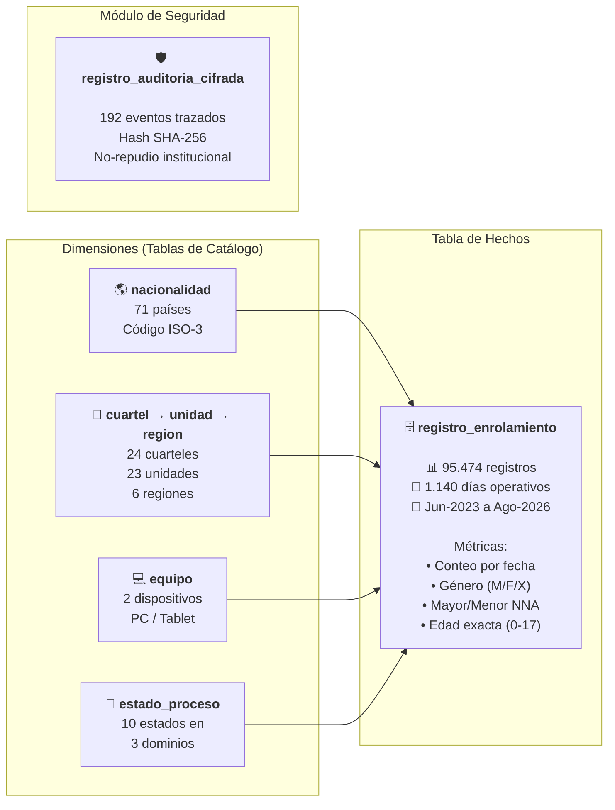

### Explicación

- **¿Qué puedo preguntar?** Con esta estructura puedo responder preguntas como:
  - *"¿Cuántos venezolanos se enrolaron en Colchanes el viernes pasado?"* → Filtrar por `nacionalidad`, `cuartel` y `fecha_enrolamiento`.
  - *"¿Cuál es la tasa de error de sincronización de la última semana?"* → Filtrar por `fecha_enrolamiento` y agrupar por `estado_proceso` donde `tipo_estado = 'SINCRONIZACION'`.
  - *"¿Cuántos menores NNA (0-17 años) se registraron este mes por región?"* → Filtrar `es_mayor_edad = false`, agrupar por `region` vía `cuartel → unidad → region`.

---

## 8. Diagrama de Vistas SQL

Las **7 vistas de solo lectura** (definidas en `db/views.sql`) pre-calculan las agrupaciones más comunes para alimentar los reportes de Telegram, la web y las exportaciones Word/Excel:

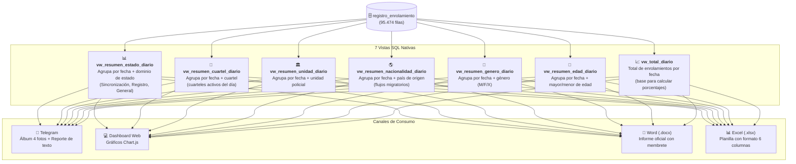

### ¿Para qué sirven las vistas?

Las vistas **no duplican datos**, solo son consultas predefinidas que se ejecutan en tiempo real sobre la tabla principal. Son como "informes guardados" en la base de datos. Ventajas:

1. **Simplicidad**: En vez de escribir un query de 30 líneas cada vez, se hace `SELECT * FROM vw_resumen_estado_diario WHERE fecha_enrolamiento = '2026-08-22'`.
2. **Seguridad**: La aplicación puede tener permiso de solo lectura sobre las vistas sin acceso directo a la tabla cruda.
3. **Rendimiento**: Los índices sobre `registro_enrolamiento` aceleran las vistas automáticamente.

### 8.1. Evidencia Operativa: Dashboard Web alimentado por Vistas SQL

A continuación se presenta la captura real del **Dashboard Web Operativo del Sistema ABIS**, el cual consume directamente las vistas SQL sobre el universo de **95.474 registros transaccionales**:

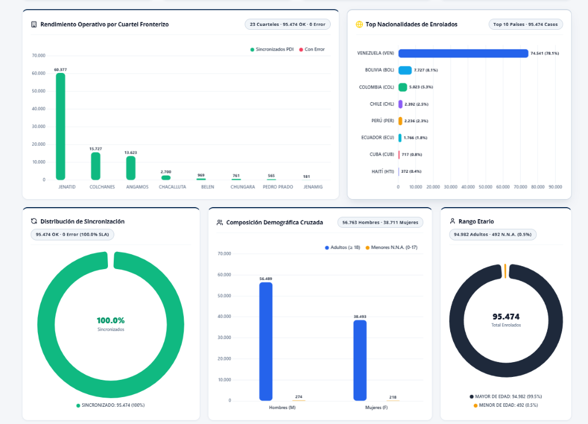

#### Mapeo de Componentes del Dashboard a Vistas SQL

| Componente Visual | Métrica / Indicador Mostrado | Vista SQL Consumida | Lógica de la Consulta SQL |
| :--- | :--- | :--- | :--- |
| **1. Rendimiento Operativo por Cuartel Fronterizo** | Carga por cuartel (JENATID: 60.377, Colchane: 15.727, Angamos: 13.623, Chacalluta: 2.700, Belén: 969, Chungará: 761, Pedro Prado: 565, JENAMIG: 181) | `vw_resumen_cuartel_diario` | `SELECT c.nombre_cuartel, COUNT(*) AS total_enrolados FROM registro_enrolamiento r JOIN cuartel c ON r.id_cuartel = c.id_cuartel GROUP BY c.nombre_cuartel ORDER BY total_enrolados DESC;` |
| **2. Top Nacionalidades de Enrolados** | Flujos migratorios normalizados en ISO-3 (Venezuela 78.1%, Bolivia 8.1%, Colombia 5.3%, Chile 2.5%, Perú 2.3%, Ecuador 1.8%, Cuba 0.8%, Haití 0.4%) | `vw_resumen_nacionalidad_diario` | `SELECT n.descripcion, n.codigo_iso, COUNT(*) AS total FROM registro_enrolamiento r JOIN nacionalidad n ON r.id_nacionalidad = n.id_nacionalidad GROUP BY n.descripcion, n.codigo_iso ORDER BY total DESC LIMIT 10;` |
| **3. Distribución de Sincronización (SLA)** | SLA de transmisión PDI Central (**100.0% SLA** · 95.474 OK · 0 Errores) | `vw_resumen_estado_diario` | `SELECT ep.descripcion AS estado, COUNT(*) AS total FROM registro_enrolamiento r JOIN estado_proceso ep ON r.id_estado_sincronizacion = ep.id_estado WHERE ep.tipo_estado = 'SINCRONIZACION' GROUP BY ep.descripcion;` |
| **4. Composición Demográfica Cruzada** | Cruce de género por grupo etario (56.763 Hombres: 56.489 adultos / 274 NNA; 38.711 Mujeres: 38.493 adultas / 218 NNA) | `vw_resumen_genero_diario` + `vw_resumen_edad_diario` | `SELECT genero, es_mayor_edad, COUNT(*) AS total FROM registro_enrolamiento GROUP BY genero, es_mayor_edad;` |
| **5. Rango Etario Protegido** | Identificación de adultos vs menores protegidos (94.982 Adultos [99.5%] vs **492 Menores N.N.A. [0.5%]**) | `vw_resumen_edad_diario` | `SELECT CASE WHEN es_mayor_edad THEN 'MAYOR DE EDAD' ELSE 'MENOR DE EDAD' END AS rango, COUNT(*) AS total FROM registro_enrolamiento GROUP BY es_mayor_edad;` |

#### ¿Por qué este enfoque garantiza alta velocidad (< 15 ms)?
- **Cero procesamiento pesado en el cliente:** El navegador no itera ni procesa 95.474 filas con JavaScript.
- **Aprovechamiento de índices B-Tree:** PostgreSQL evalúa las vistas utilizando `idx_enrol_fecha`, `idx_enrol_cuartel` y `idx_enrol_estados`.
- **Ligereza en la red:** El backend transmite únicamente los datos consolidados en formato JSON ligero (menos de 5 KB).

---

## 9. Diagrama de Flujo de Datos (ETL → BD → Salidas)

Muestra el recorrido completo de un dato desde su origen (Excel de la PDI) hasta los canales de entrega:

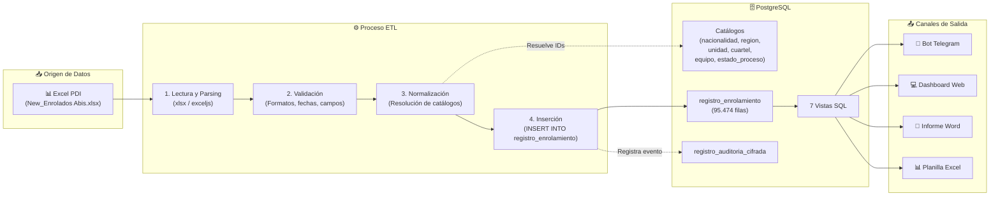

---

## 10. Índices y Optimización

La base de datos cuenta con **7 índices B-Tree** diseñados para responder consultas analíticas sobre 95.474+ filas en menos de 15 milisegundos:

| # | Índice                                | Tabla                          | Columna                      | Propósito                                    |
| :-: | :------------------------------------- | :----------------------------- | :--------------------------- | :-------------------------------------------- |
| 1 | `idx_registro_fecha_enrolamiento`    | `registro_enrolamiento`      | `fecha_enrolamiento`       | Filtrar por fecha (reportes diarios y rangos) |
| 2 | `idx_registro_cuartel`               | `registro_enrolamiento`      | `id_cuartel`               | Agrupar por cuartel/unidad/región            |
| 3 | `idx_registro_nacionalidad`          | `registro_enrolamiento`      | `id_nacionalidad`          | Calcular flujos migratorios por país         |
| 4 | `idx_registro_estado_sincronizacion` | `registro_enrolamiento`      | `id_estado_sincronizacion` | Tasa SLA de sincronización PDI               |
| 5 | `idx_registro_estado_registro`       | `registro_enrolamiento`      | `id_estado_registro`       | Tasa de registro biométrico ABIS             |
| 6 | `idx_registro_estado_general`        | `registro_enrolamiento`      | `id_estado_general`        | Consistencia documental general               |
| 7 | `idx_auditoria_fecha`                | `registro_auditoria_cifrada` | `fecha_evento`             | Consultas de auditoría por período          |

---

## 11. Seguridad y Auditoría

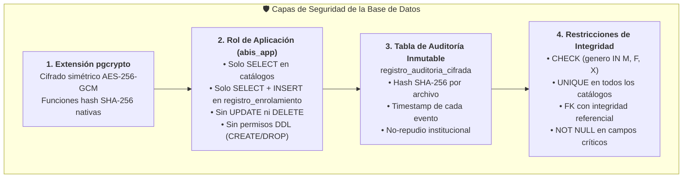

### Principio de Mínimo Privilegio

El archivo `db/hardening.sql` define un rol `abis_app` con permisos estrictamente limitados:

- **Catálogos**: Solo lectura (`SELECT`) — la aplicación nunca los modifica.
- **Tabla transaccional**: Solo lectura e inserción (`SELECT`, `INSERT`) — **nunca puede UPDATE ni DELETE** registros ya cargados.
- **Vistas**: Solo lectura (`SELECT`).
- **DDL**: El rol NO puede crear, modificar ni eliminar tablas.

---

## 12. Normalización (3FN)

El esquema cumple con la **Tercera Forma Normal (3FN)**:

| Forma Normal  | Requisito                                                            | ¿Se cumple? | Evidencia                                                                                                        |
| :------------ | :------------------------------------------------------------------- | :----------: | :--------------------------------------------------------------------------------------------------------------- |
| **1FN** | Todos los atributos son atómicos (sin listas ni grupos repetitivos) |      ✅      | Cada columna almacena un solo valor.`genero` es `CHAR(1)`, no una lista.                                     |
| **2FN** | Cada atributo no-clave depende completamente de la PK                |      ✅      | La PK es`id_registro` (simple). Todos los atributos dependen de ella completamente.                            |
| **3FN** | No hay dependencias transitivas entre atributos no-clave             |      ✅      | `nombre_region` NO está en `cuartel` — se accede vía `cuartel → unidad → region`. No hay redundancia. |

### ¿Qué se evita con la normalización?

- ❌ **Sin normalizar**: Si guardara el nombre de la región directamente en cada uno de los 95.474 registros, el texto "ARICA - PARINACOTA" se repetiría miles de veces y un cambio de nombre obligaría a actualizar miles de filas.
- ✅ **Normalizado**: El nombre se guarda UNA vez en `region` (6 filas), y `registro_enrolamiento` solo guarda el `id_cuartel`, desde el cual se navega `cuartel → unidad → region` para obtener el nombre.

---

> **Archivo fuente**: [`db/schema.sql`](../db/schema.sql) | **Catálogos**: [`db/seed_catalogos.sql`](../db/seed_catalogos.sql) | **Vistas**: [`db/views.sql`](../db/views.sql) | **Hardening**: [`db/hardening.sql`](../db/hardening.sql)
