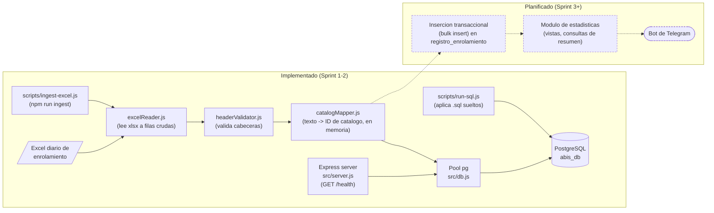

# Diagrama de arquitectura — Sistema ABIS

Vista de componentes: lo ya implementado (Sprint 1) versus lo planificado por el roadmap. Se
actualiza a medida que cada pieza planificada pasa a estar implementada.

## Lectura del diagrama

- **Implementado**: el servidor Express expone `GET /health`, que usa el pool compartido de
  `src/db.js` para verificar la conexión a PostgreSQL. `scripts/run-sql.js` es el mecanismo
  genérico para aplicar cualquier `.sql` (schema o seed) contra la misma base. El módulo de
  ingesta (`src/ingest/`) lee un Excel, valida sus cabeceras contra `headerSchema.js` y mapea cada
  fila de texto libre a los IDs de catálogo correspondientes — todo en memoria, sin escribir en
  la base todavía. `scripts/ingest-excel.js` (`npm run ingest -- <archivo>`) lo corre manualmente.
- **Planificado** (líneas punteadas): Sprint 3 toma las filas ya mapeadas por `catalogMapper.js` y
  las inserta transaccionalmente (bulk insert) en `registro_enrolamiento`. El módulo de
  estadísticas y la notificación por Telegram son posteriores (ver [roadmap.md](roadmap.md)).

## Notas sobre el módulo de ingesta (Sprint 2)

- Las cabeceras esperadas del Excel (`src/ingest/headerSchema.js`) son **inferidas** del informe
  de requerimientos — no se validaron todavía contra un archivo Excel real. Es el único archivo a
  editar si los nombres de columna reales difieren.
- `catalogMapper.js` resuelve `Cuartel` dentro de `Unidad` dentro de `Region`, porque
  `nombre_cuartel` no es único a nivel global en el esquema (solo `(nombre_cuartel, id_unidad)`
  lo es) — ver [er-diagrama.md](er-diagrama.md).

## Cómo mantenerlo actualizado

Cuando un componente del subgrafo "Planificado" se implemente:

1. Moverlo al subgrafo `impl` y quitarle la clase `planned` (para que deje de verse punteado).
2. Ajustar las flechas sólidas/punteadas según las nuevas dependencias reales.
3. Actualizar la sección "Lectura del diagrama" con una frase breve sobre qué hace el componente.
