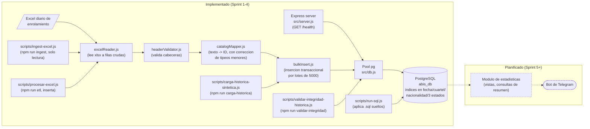

# Diagrama de arquitectura — Sistema ABIS

Vista de componentes: lo ya implementado (Sprint 1) versus lo planificado por el roadmap. Se
actualiza a medida que cada pieza planificada pasa a estar implementada.

## Lectura del diagrama

- **Implementado**: el servidor Express expone `GET /health`, que usa el pool compartido de
  `src/db.js` para verificar la conexión a PostgreSQL. `scripts/run-sql.js` es el mecanismo
  genérico para aplicar cualquier `.sql` (schema o seed) contra la misma base. El módulo de
  ingesta (`src/ingest/`) lee un Excel, valida sus cabeceras y mapea cada fila de texto libre a
  los IDs de catálogo correspondientes, tolerando errores de tipeo menores (`src/etl/`). El módulo
  ETL (`src/etl/index.js`) encadena ese mapeo con la inserción transaccional por lotes
  (`bulkInsert.js`) en `registro_enrolamiento`. `npm run ingest` corre solo la lectura/mapeo (no
  inserta, útil para previsualizar); `npm run etl` corre el flujo completo e inserta.
  `scripts/carga-historica-sintetica.js` y `scripts/validar-integridad-historica.js` (Sprint 4)
  son herramientas de prueba de estrés e integridad, no parte del flujo diario de producción.
- **Planificado** (líneas punteadas): el módulo de estadísticas y la notificación por Telegram
  son los próximos pasos del roadmap (ver [roadmap.md](roadmap.md)).

## Notas sobre el módulo de ingesta y ETL

- Las cabeceras esperadas del Excel (`src/ingest/headerSchema.js`) son **inferidas** del informe
  de requerimientos — no se validaron todavía contra un archivo Excel real. Es el único archivo a
  editar si los nombres de columna reales difieren.
- `catalogMapper.js` resuelve `Cuartel` dentro de `Unidad` dentro de `Region`, porque
  `nombre_cuartel` no es único a nivel global en el esquema (solo `(nombre_cuartel, id_unidad)`
  lo es) — ver [er-diagrama.md](er-diagrama.md).
- **Corrección de tipeos (Sprint 3)**: `src/etl/catalogResolver.js` tolera errores de tipeo menores
  (distancia de edición ≤ 2) en `Nacionalidad`, `Equipo` y los tres campos de `Estado`, dejando
  rastro de cada corrección aplicada. `Region`/`Unidad`/`Cuartel` exigen coincidencia exacta a
  propósito — al ser una jerarquía de 3 niveles, una corrección automática ambigua ahí es más
  riesgosa que en un catálogo plano.
- `bulkInsert.js` inserta todas las filas válidas de un archivo en una única transacción; las
  filas con errores no bloquean al resto del lote (se reportan aparte, no tumban la carga diaria).
- **Carga por lotes (Sprint 4)**: `bulkInsert.js` particiona internamente en lotes de 5.000 filas
  (límite de PostgreSQL: 65.535 parámetros por consulta), pero todos los lotes de una misma
  llamada comparten una única transacción — probado con 95.000 filas sintéticas insertadas en
  19 lotes en ~2.6s, ver [`AVANCE_SPRINT4.md`](../sprints/AVANCE_SPRINT4.md).

## Cómo mantenerlo actualizado

Cuando un componente del subgrafo "Planificado" se implemente:

1. Moverlo al subgrafo `impl` y quitarle la clase `planned` (para que deje de verse punteado).
2. Ajustar las flechas sólidas/punteadas según las nuevas dependencias reales.
3. Actualizar la sección "Lectura del diagrama" con una frase breve sobre qué hace el componente.
