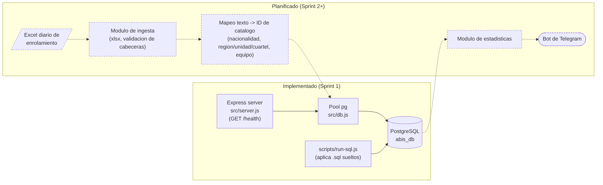

# Diagrama de arquitectura — Sistema ABIS

Vista de componentes: lo ya implementado (Sprint 1) versus lo planificado por el roadmap. Se
actualiza a medida que cada pieza planificada pasa a estar implementada.

## Lectura del diagrama

- **Implementado**: el servidor Express expone `GET /health`, que usa el pool compartido de
  `src/db.js` para verificar la conexión a PostgreSQL. `scripts/run-sql.js` es el mecanismo
  genérico para aplicar cualquier `.sql` (schema o seed) contra la misma base.
- **Planificado** (líneas punteadas): el módulo de ingesta de Excel (Sprint 2) leerá el archivo
  diario, validará su estructura y mapeará las columnas de texto libre a los IDs de las tablas de
  catálogo antes de insertar en `registro_enrolamiento`. El módulo de estadísticas y la
  notificación por Telegram son posteriores en el roadmap (ver [roadmap.md](roadmap.md)).

## Cómo mantenerlo actualizado

Cuando un componente del subgrafo "Planificado" se implemente:

1. Moverlo al subgrafo `impl` y quitarle la clase `planned` (para que deje de verse punteado).
2. Ajustar las flechas sólidas/punteadas según las nuevas dependencias reales.
3. Actualizar la sección "Lectura del diagrama" con una frase breve sobre qué hace el componente.
