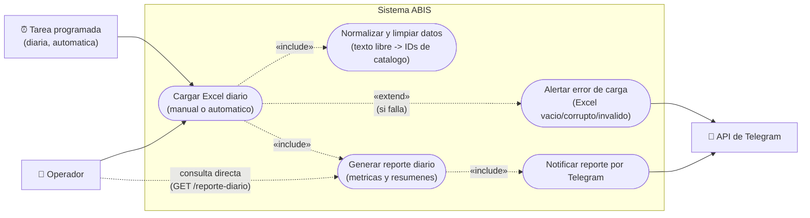

# Diagrama de casos de uso — Sistema ABIS

Vista de alto nivel: qué hace el sistema y quién lo dispara, sin entrar en implementación —
cubre los 4 requerimientos funcionales de la sección 2 del
[informe de requerimientos](../informe-requerimientos.md) (ETL/Ingesta, Normalización y Limpieza,
Generación de Reportes Diarios, Integración con Telegram). Mermaid no tiene un tipo de diagrama
UML de casos de uso nativo — se aproxima con un flowchart: actores como rectángulos, casos de uso
como óvalos (forma "stadium"), dentro del límite del sistema.

## Lectura del diagrama

- **Actores**: el **Operador** puede disparar la carga a mano (`npm run flujo-diario`) o
  consultar el reporte de una fecha directamente (`GET /reporte-diario`, sin recargar nada). La
  **Tarea programada** dispara la misma carga todos los días sin intervención humana — el
  informe pide explícitamente que la carga sea "automatizada o manual", y acá son dos actores
  distintos entrando al mismo caso de uso. La **API de Telegram** es un actor secundario: el
  sistema le envía datos, no al revés.
- **Cargar Excel diario** (UC1) siempre incluye **Normalizar y limpiar datos** (UC2) y, si tiene
  éxito, **Generar reporte diario** (UC3) — así es como lo encadena `flujoDiario.js` (Sprint 7).
- **Generar reporte diario** (UC3) no depende de que se acabe de cargar un Excel: también se
  puede invocar solo, consultando una fecha ya cargada (`GET /reporte-diario`).
- **Alertar error de carga** (UC5) extiende UC1 — solo se dispara si el Excel viene vacío,
  corrupto, o con cabeceras inválidas (las 3 ramas de error de
  [`flujoDiario.js`](secuencia-flujo-diario.md)). También notifica por Telegram, pero es un
  camino distinto al del reporte exitoso.

## Cómo mantenerlo actualizado

Si se agrega un nuevo requerimiento funcional (por ejemplo, un actor o disparador nuevo), agregar
el caso de uso correspondiente acá antes de cerrar el sprint que lo implemente.
