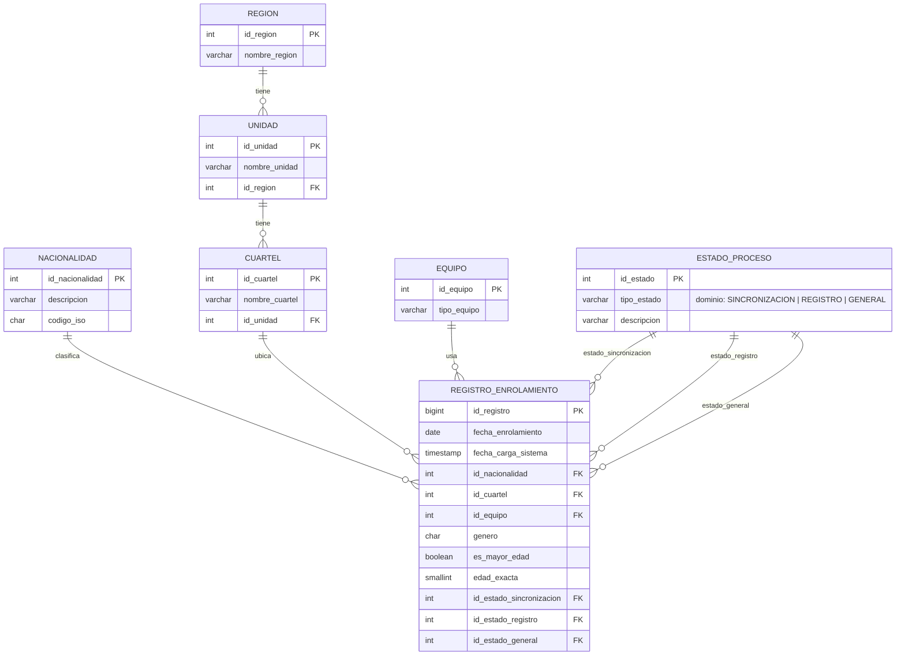

# Diagrama entidad-relación — Sistema ABIS

Refleja el esquema normalizado (3NF) definido en [`db/schema.sql`](../../db/schema.sql). Se
renderiza automáticamente en GitHub (no requiere herramientas externas).



## Notas de diseño

- `region` → `unidad` → `cuartel` es una jerarquía estricta (cada nivel referencia al anterior).
- `estado_proceso` es un catálogo genérico reutilizado en tres dominios independientes
  (`tipo_estado`); no crear tablas de estado separadas por dominio.
- `registro_enrolamiento` tiene **tres** llaves foráneas independientes hacia `estado_proceso`
  (sincronización, registro, general), además de las llaves hacia `nacionalidad`, `cuartel` y
  `equipo`.
- Índices (Sprint 1 y 4) sobre `fecha_enrolamiento`, `id_cuartel`, `id_nacionalidad`,
  `id_estado_sincronizacion`, `id_estado_registro` e `id_estado_general` — pensados para las
  agrupaciones del reporte diario y el dashboard de estadísticas, verificados con `EXPLAIN
  ANALYZE` sobre 95k+ registros en [`AVANCE_SPRINT4.md`](../sprints/AVANCE_SPRINT4.md).
- `db/views.sql` (Sprint 5) define 4 vistas de solo lectura sobre `registro_enrolamiento` para
  facilitar reportes (resumen por estado, nacionalidad, cuartel y total diario) — no son parte del
  modelo de datos en sí, no se muestran en el diagrama ER. Ver
  [`AVANCE_SPRINT5.md`](../sprints/AVANCE_SPRINT5.md).

## Cómo mantenerlo actualizado

Este diagrama es manual, no generado. Cada vez que `db/schema.sql` cambie (nueva tabla, columna o
llave foránea):

1. Actualizar el bloque ` ```mermaid ` de arriba para reflejar el cambio.
2. Si agregás una tabla nueva, sumarla tanto a las relaciones (arriba) como a la definición de
   atributos (abajo).
3. Confirmar que el diagrama renderiza bien previsualizando el `.md` en GitHub (o en el editor)
   antes de commitear.
