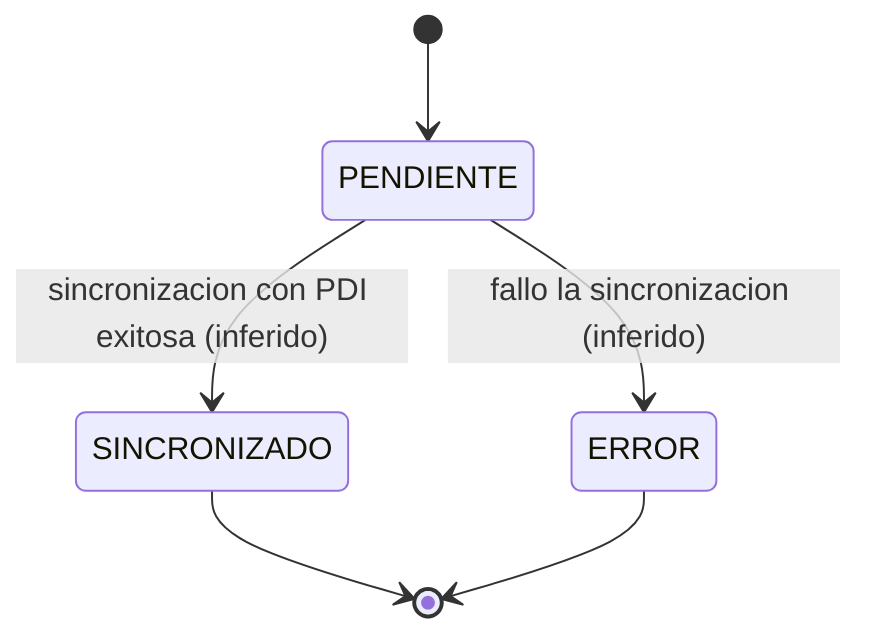
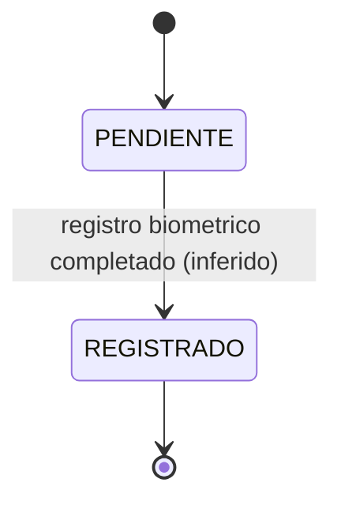
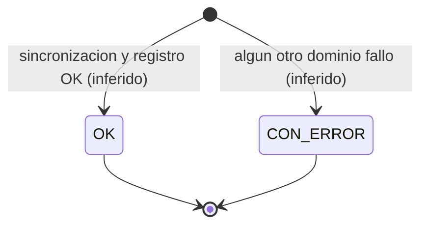

# Diagrama de estados — `estado_proceso`

Los tres dominios independientes del catálogo genérico `estado_proceso` (ver
[er-diagrama.md](er-diagrama.md)): Sincronización, Registro y Estado General — sección 4 del
[informe de requerimientos](../informe-requerimientos.md).

## ⚠️ Salvedad importante antes de leer el diagrama

**Sistema ABIS no transiciona entre estos estados — solo los lee.** El valor de cada dominio ya
viene decidido en el Excel diario, generado por "otra base de datos" (sección 1 del informe). Acá
adentro, ese valor se inserta una única vez (`registro_enrolamiento`) y nunca se modifica — el rol
`abis_app` (Sprint 9) ni siquiera tiene permiso de `UPDATE`. Las flechas de "transición" de abajo
son una **interpretación razonable de qué probablemente significa cada valor**, no un
comportamiento verificado del sistema origen (que está fuera del alcance de este proyecto).

## Sincronización (con PDI)

## Registro (biométrico)

## Estado General

A diferencia de los otros dos, **General no tiene un `PENDIENTE`** en el catálogo sembrado — no
parece tener un ciclo de vida propio, sino que se comporta como un resumen derivado de los otros
dos dominios (interpretación nuestra; el informe no lo especifica).

## Valores actuales y su emoji en Telegram

Los valores de abajo son los que trae `db/seed_catalogos.sql` (catálogo de ejemplo — a
reemplazar por el real institucional, ver [`PLAN_DESPLIEGUE.md`](../PLAN_DESPLIEGUE.md)). El
emoji con el que aparecen en el reporte de Telegram sale de `emojiPara()` en
[`formatearReporte.js`](../../src/telegram/formatearReporte.js), que matchea por **patrón de
texto**, no por el valor exacto — así sigue funcionando aunque cambie el catálogo real.

| Dominio | Valor | Emoji | Por qué (patrón) |
|---|---|---|---|
| Sincronización | `SINCRONIZADO` | ✅ | No matchea ningún patrón conocido → default |
| Sincronización | `PENDIENTE` | ⏳ | Contiene "PENDIENTE" |
| Sincronización | `ERROR` | ❌ | Contiene "ERROR" |
| Registro | `REGISTRADO` | ✅ | Default |
| Registro | `PENDIENTE` | ⏳ | Contiene "PENDIENTE" |
| General | `OK` | ✅ | Default |
| General | `CON_ERROR` | ❌ | Contiene "ERROR" |

## Cómo mantenerlo actualizado

Si el catálogo institucional real (cuando reemplace a `seed_catalogos.sql`) confirma un
comportamiento distinto — por ejemplo, si Sincronización sí tiene una transición de vuelta a
`PENDIENTE`, o si General resulta tener su propio `PENDIENTE` — corregir el diagrama y sacar la
salvedad de "inferido" en las transiciones que se confirmen.
