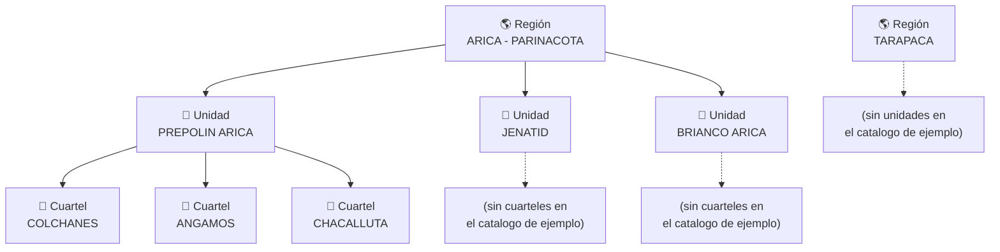

# Jerarquía Región → Unidad → Cuartel

Árbol simple de la jerarquía geográfica/organizacional, separado de la notación entidad-relación
(ver [er-diagrama.md](er-diagrama.md)) para quien solo quiera entender esta estructura sin leer
un ERD completo. Datos = el catálogo de ejemplo actual (`db/seed_catalogos.sql`), no el listado
institucional real — ver la nota en [`PLAN_DESPLIEGUE.md`](../PLAN_DESPLIEGUE.md).

## Lectura del diagrama

- Es una jerarquía estricta de 3 niveles: cada `cuartel` pertenece a exactamente una `unidad`, y
  cada `unidad` a exactamente una `region` (FK en cascada, ver `db/schema.sql`).
- El catálogo de ejemplo está deliberadamente incompleto — solo `PREPOLIN ARICA` tiene cuarteles
  cargados, y `TARAPACA` no tiene ninguna unidad. Por eso, en cualquier reporte generado con datos
  de prueba, `unidadesActivas` siempre muestra 100% `PREPOLIN ARICA` (es la única unidad con
  cuarteles con los que se puede enrolar a alguien) — no es un bug, es una limitación de los datos
  de ejemplo.
- **Por qué `cuartel.nombre_cuartel` no alcanza solo**: el nombre de un cuartel es único dentro de
  su unidad, pero no globalmente — dos unidades distintas podrían tener un cuartel con el mismo
  nombre. Por eso `catalogMapper.js` (ver
  [normalizacion-limpieza.md](normalizacion-limpieza.md)) resuelve primero la Unidad dentro de la
  Región, y recién después el Cuartel dentro de esa Unidad — nunca busca un cuartel por nombre
  solo.

## Cómo mantenerlo actualizado

Cuando se reemplace `db/seed_catalogos.sql` por el catálogo institucional real, regenerar este
árbol con la estructura real (va a ser bastante más grande — esto es solo un ejemplo mínimo).
