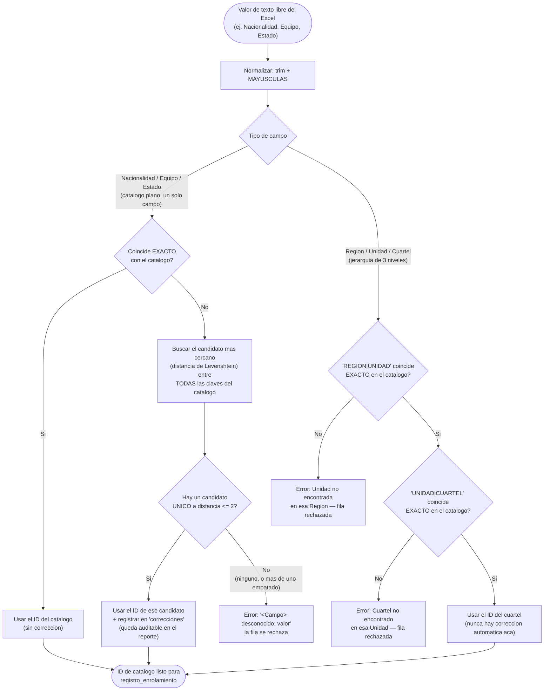

# Diagrama de flujo — Normalización y Limpieza

Detalle del requerimiento funcional "Normalización y Limpieza" (sección 2 del
[informe de requerimientos](../informe-requerimientos.md): *"resolver inconsistencias en el
Excel... mapeando los valores en texto a llaves foráneas"*). Muestra cómo se resuelve un valor de
texto libre del Excel contra los catálogos, implementado en
[`src/ingest/catalogMapper.js`](../../src/ingest/catalogMapper.js) y
[`src/etl/catalogResolver.js`](../../src/etl/catalogResolver.js).

## Lectura del diagrama

- Hay dos caminos completamente distintos según el campo, y es a propósito:
  - **Nacionalidad, Equipo y los tres campos de Estado** son catálogos planos (un solo texto
    identifica una fila) — ahí un error de tipeo es fácil de corregir sin ambigüedad razonable
    (`catalogResolver.js`, distancia de edición ≤ 2, y solo si el candidato más cercano es
    único).
  - **Región, Unidad y Cuartel** son una jerarquía de 3 niveles, y `cuartel.nombre_cuartel` ni
    siquiera es único a nivel global (solo dentro de su unidad) — corregir un tipeo ahí
    automáticamente podría "adivinar" el cuartel equivocado de otra unidad con nombre parecido.
    Por eso esos tres campos exigen coincidencia exacta, sin tolerancia a tipeos.
- Una corrección automática (rama "Distancia <= 2 → Sí") **no es silenciosa**: queda registrada
  en el array `correcciones` de la fila mapeada, y aparece en la consola del ETL
  (`npm run etl`/`npm run flujo-diario`) y en `AVANCE_SPRINT3.md`/`AVANCE_SPRINT6.md` como algo
  a revisar, no una corrección invisible.
- Esto corre **por cada campo de cada fila** del Excel — una fila puede tener, por ejemplo, una
  corrección en `Equipo` y al mismo tiempo un error irrecuperable en `Cuartel`; en ese caso toda
  la fila se rechaza igual (ver [`AVANCE_SPRINT3.md`](../sprints/AVANCE_SPRINT3.md)).

## Cómo mantenerlo actualizado

Si cambia el umbral de distancia (`MAX_DISTANCE` en `catalogResolver.js`) o si algún campo pasa de
un lado del diagrama al otro (por ejemplo, si Región/Unidad/Cuartel alguna vez suman tolerancia a
tipeos), reflejarlo acá.
