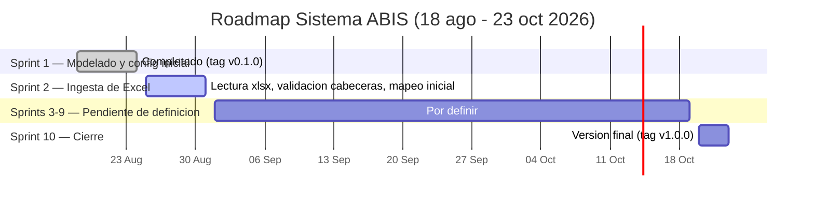

# Roadmap — Sistema ABIS

Línea de tiempo de los 10 sprints semanales (18 ago – 23 oct 2026). Solo el contenido de Sprint 1
(cerrado) y Sprint 2 (siguiente) está detallado en la documentación del proyecto hoy; los sprints
3–9 figuran como "pendiente de definición" hasta que se concrete su alcance — no inventar
contenido para ellos, completar esta sección a medida que se definan.



## Convención de versionado

Cada sprint cerrado se marca con un tag de git `vX.Y.0`, donde `Y` es el número de sprint:

| Sprint | Tag      | Estado |
|--------|----------|--------|
| 1      | `v0.1.0` | Cerrado |
| 2      | `v0.2.0` | Próximo |
| ...    | `v0.N.0` | — |
| 10     | `v1.0.0` | Versión final |

Al cerrar un sprint:

```bash
git add .
git commit -m "Sprint N: <resumen>"
git tag -a v0.N.0 -m "Sprint N: <resumen>"
git push origin main --tags
```

## Cómo mantenerlo actualizado

Al cerrar cada sprint: marcar su sección como `done` en el diagrama, agregar el detalle real del
siguiente sprint (reemplazando "pendiente de definición" por su alcance concreto), y actualizar la
tabla de tags.
