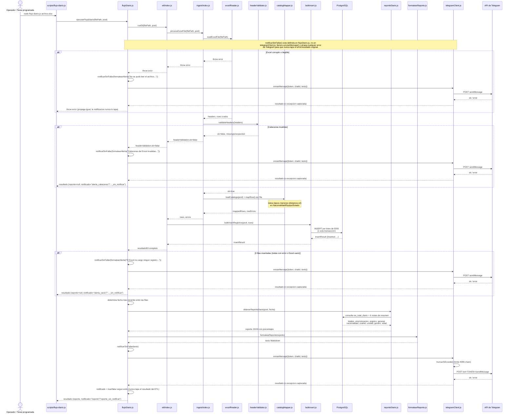

# Diagrama de secuencia — Flujo diario end-to-end

Recorrido de `npm run flujo-diario -- <archivo.xlsx>` (Sprint 7), desde el Excel hasta la
notificación en Telegram, incluyendo las tres ramas de error que `flujoDiario.js` maneja sin
fallar en silencio. Se renderiza automáticamente en GitHub.

## Lectura del diagrama

- El flujo tiene **una sola entrada** (`ejecutarFlujoDiario`) y **tres puntos de salida
  temprana**, cada uno notificando por Telegram *antes* de retornar (nunca falla en silencio):
  Excel ilegible, cabeceras inválidas, o cero filas insertadas.
- `notificarSinFallar()` y `notificar()` están definidas en `flujoDiario.js`, no en
  `telegramClient.js` — son las que deciden el `true`/`false` que determina si `notificado`
  termina con el sufijo `_sin_notificar`. La única función que vive en `telegramClient.js` es
  `enviarMensaje()`, que hace la llamada HTTP real. Ver
  [`AVANCE_SPRINT8.md`](../sprints/AVANCE_SPRINT8.md) sobre por qué `notificarSinFallar` existe:
  para que una falla de Telegram nunca tape el error/resultado original que se estaba
  reportando.
- El mapeo de catálogos (`catalogMapper.js`) y la inserción (`bulkInsert.js`) son los únicos pasos
  que tocan la base de datos antes del reporte final; el reporte en sí vuelve a consultarla
  (vistas de `db/views.sql`), no reutiliza los datos ya insertados en memoria.
- Si el Excel trae varias fechas de enrolamiento (no debería, pero no se asume), el flujo reporta
  sobre la más reciente en vez de fallar.

## Cómo mantenerlo actualizado

Si cambia el orden de pasos en `flujoDiario.js`, `etl/index.js` o `ingest/index.js` (por ejemplo,
una nueva validación o un nuevo punto de notificación), reflejar el cambio acá antes de cerrar el
sprint correspondiente — igual que con `arquitectura.md`.
