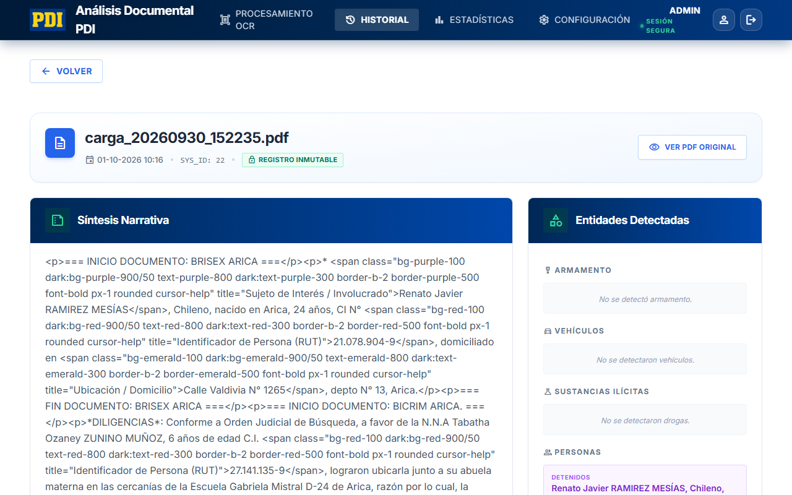
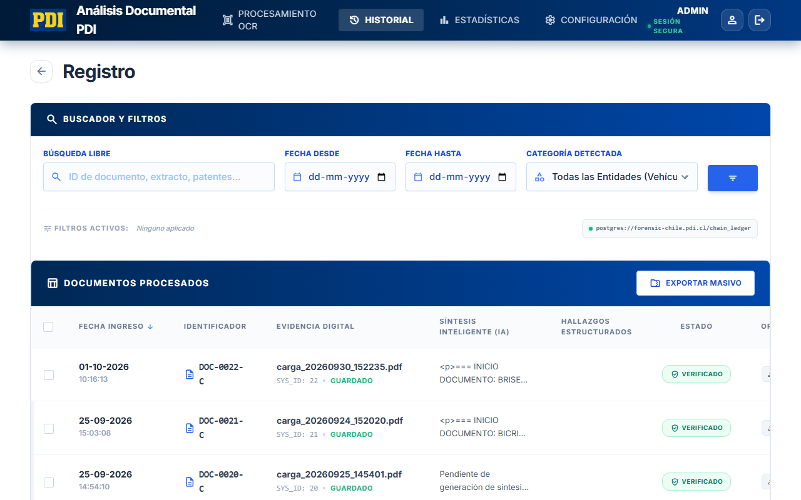
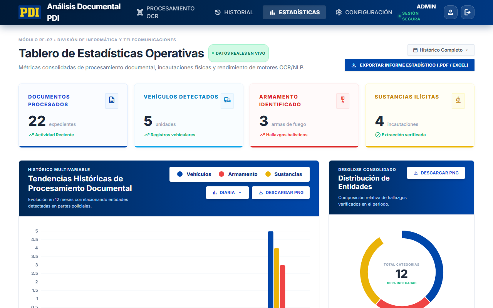

# SIAD - Sistema de Análisis Documental

Un sistema avanzado diseñado para facilitar el análisis, extracción y gestión de evidencia documental.



## 🚀 Características Principales

*   **📄 OCR Avanzado:** Extracción de texto desde imágenes y PDFs escaneados utilizando Tesseract OCR y PyMuPDF.
*   **🔍 Extracción de Entidades y Resumen:** Procesamiento de lenguaje natural (NLP) con spaCy para extraer entidades directamente del texto, apoyado por librerías locales de generación de resúmenes.
*   **📊 Panel de Estadísticas y Tendencias:** Dashboard interactivo para visualizar el flujo de documentos y las estadísticas a lo largo del tiempo.
*   **📂 Historial y Búsqueda:** Búsqueda rápida sobre el repositorio de documentos y descarga de reportes estandarizados.

## 🛠️ Stack Tecnológico

*   **Backend:** Python 3, Flask, Werkzeug.
*   **Frontend:** HTML5, Tailwind CSS, JavaScript (Vanilla).
*   **Base de Datos:** PostgreSQL (almacenamiento inmutable).
*   **NLP & Procesamiento:** spaCy, Tesseract OCR, librerías de resumen.
*   **Manejo de Archivos:** PyMuPDF (fitz), Pillow, openpyxl, docxtpl.

## 💻 Pantallas del Sistema

### Historial de Procesamiento


### Dashboard Estadístico


## ⚙️ Requisitos de Instalación

1.  **Python 3.9+** instalado en tu sistema.
2.  **PostgreSQL** (versión 13 o superior).
3.  **Tesseract OCR** instalado (`sudo apt install tesseract-ocr` en Linux, o mediante el instalador oficial en Windows).

## 🚀 Configuración y Ejecución (Entorno Local)

1.  **Clonar el repositorio:**
    ```bash
    git clone https://github.com/ashley-adaros/Sistema_analisis.git
    cd Sistema_analisis
    ```

2.  **Crear un entorno virtual e instalar dependencias:**
    ```bash
    python -m venv .venv
    # Windows
    .venv\Scripts\activate
    # Linux/Mac
    source .venv/bin/activate
    
    pip install -r requirements.txt
    python -m spacy download es_core_news_sm
    ```

3.  **Configurar Variables de Entorno:**
    Crea un archivo `.env` en la raíz del proyecto basado en `.env.example`:
    ```env
    DB_HOST=127.0.0.1
    DB_PORT=5432
    DB_NAME=sistema_analisis
    DB_USER=usuario
    DB_PASSWORD=secreto
    
    # Solo en Windows, si Tesseract no está en el PATH
    # TESSERACT_CMD=C:\Program Files\Tesseract-OCR\tesseract.exe
    ```

4.  **Iniciar la Aplicación:**
    ```bash
    flask run
    ```
    El sistema estará disponible en `http://localhost:5000`.

5.  **Credenciales por Defecto:**
    El sistema inicializa un usuario administrador por defecto la primera vez que se conecta a la base de datos:
    *   **Usuario:** `admin`
    *   **Contraseña:** `admin123`

## 👥 Autores

Proyecto desarrollado y mantenido por **Ashley Adaros**.

---
*Este software ha sido diseñado con fines académicos e institucionales.*
