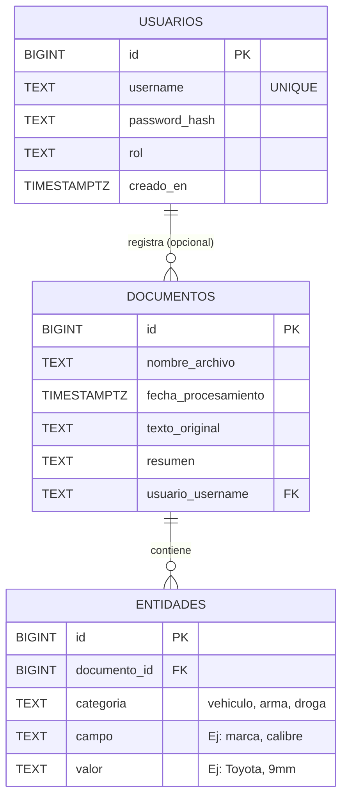

# 1. Diagrama Entidad-Relación (Base de Datos)

Muestra el modelo EAV (Entidad-Atributo-Valor) utilizado en PostgreSQL para guardar los documentos y las piezas de inteligencia sin columnas rígidas, permitiendo escalabilidad total.

