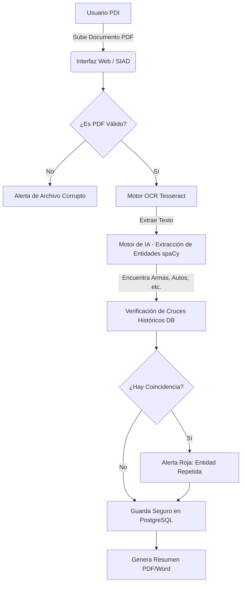

# 2. Diagrama de Flujo del Proceso (Pipeline de Inteligencia)

Explica paso a paso el viaje de la información: desde que el usuario sube el PDF hasta que la IA extrae los datos, busca cruces históricos y guarda la evidencia inmutable.

