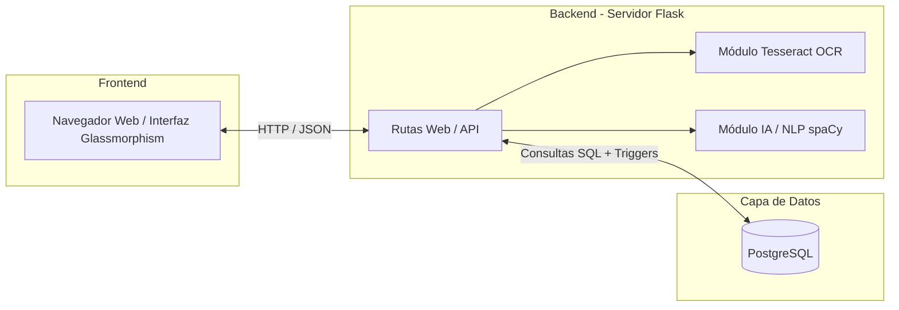

# 3. Diagrama de Arquitectura de Componentes

Muestra cómo están separadas las tecnologías en tres capas principales: Frontend (Vistas), Backend (Cerebro) y Base de Datos (Persistencia Inmutable).

