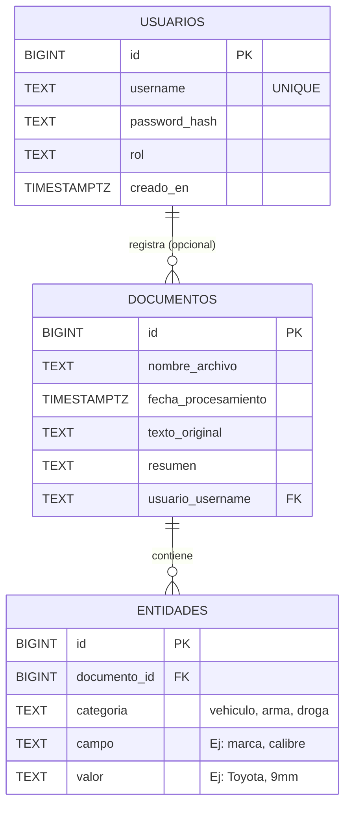
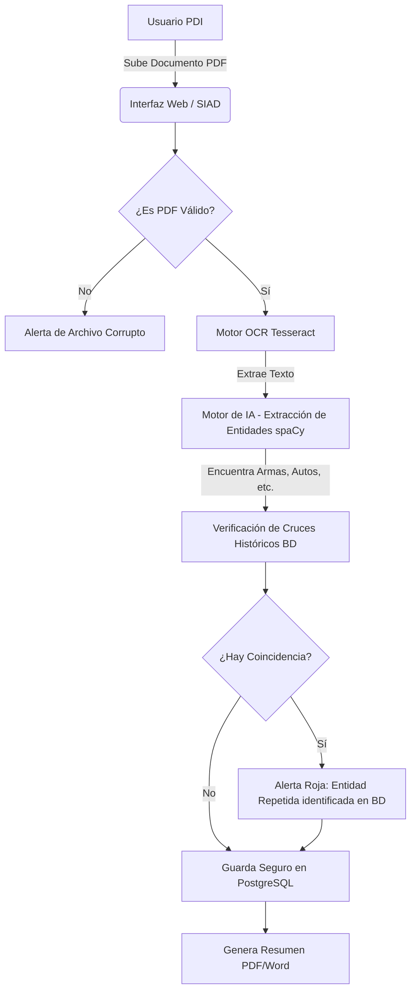
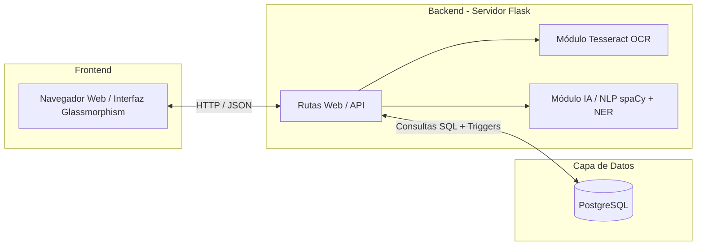
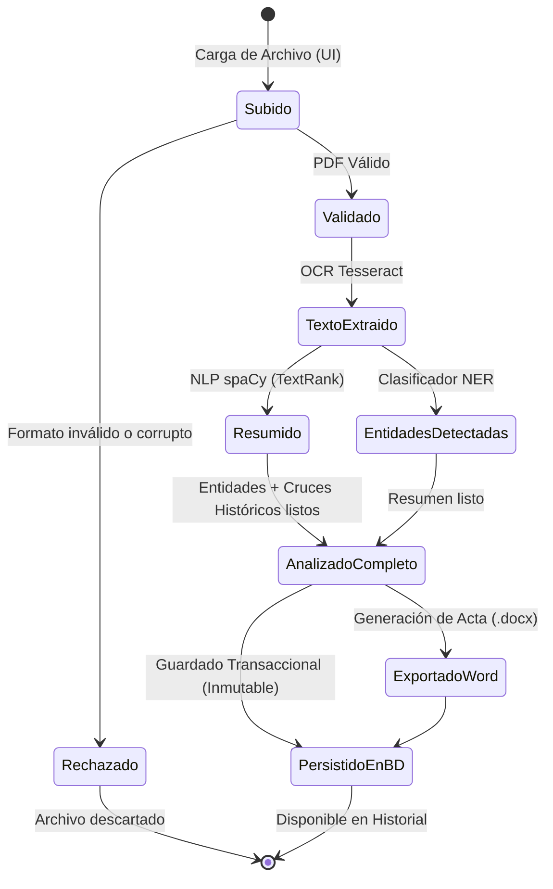

# Diagramas de Arquitectura (Actualizados)

Este documento contiene los diagramas arquitectónicos y de flujo del Sistema de Análisis Documental (SIAD), actualizados para reflejar el estado actual del sistema en producción, incluyendo el nuevo motor de coincidencias cruzadas.

Los gráficos de planificación heredados (Gantt, PERT) de la fase inicial de desarrollo han sido removidos por obsolescencia.

## 1. Diagrama Entidad-Relación (Modelo de Base de Datos)

El sistema utiliza un **Modelo EAV (Entidad-Atributo-Valor)** en PostgreSQL para guardar los documentos y las piezas de inteligencia extraídas sin depender de columnas rígidas, permitiendo escalabilidad total para futuras entidades.

## 2. Diagrama de Flujo del Proceso (Pipeline de Inteligencia)

Explica paso a paso el viaje de la información: desde que el usuario sube el PDF, pasando por la extracción de datos y la **verificación automática de cruces históricos**, hasta el guardado inmutable.

## 3. Diagrama de Arquitectura de Componentes

Muestra cómo están separadas las tecnologías en tres capas principales: Frontend (Vistas web), Backend (Procesamiento y Motores) y Base de Datos (Persistencia Inmutable).

## 4. Diagrama de Estados del Documento

Describe las transiciones de estado que experimenta un archivo documental desde su ingreso al sistema hasta su exportación o persistencia en el historial policial.

